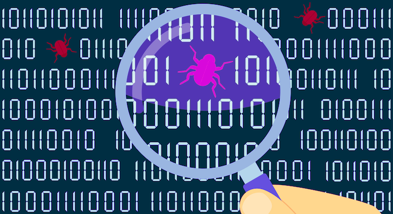

# 🔍 Activity 04 - Newton's Method Debugging Adventure

CMPSC101 :: Fall 2025

**Assigned**: 26 Sept 2025
**Due**: 26 Sept 2025 at 1:00 PM (Cut off due date and time).

Welcome to your Python debugging challenge! 🐛→✨

In this activity, you will step into the shoes of a developer who needs to fix and complete a Newton's method square root calculator. The code is *intentionally broken* with various bugs, missing pieces, and incomplete functions. Your mission is to debug, complete, and understand this mathematical algorithm while practicing essential Python programming skills.



## 📚 Learning Objectives

By the end of this activity, you will have hands-on experience with:

* **Debugging strategies** - Finding and fixing real code errors
* **While loops** - Implementing iterative algorithms  
* **Conditional statements** - Input validation and convergence checking
* **Data structures** - Working with lists and dictionaries
* **Function design** - Understanding how functions work together
* **Mathematical programming** - Implementing Newton's method for square roots
* **Error handling** - Making programs user-friendly and robust

## 🎯 The Challenge

You've been given two Python files that *do not work correctly*:

* `src/main.py` - The user interface (contains **16 TODO items**)
* `src/math_approximator.py` - The mathematical engine (contains **11 TODO items**)

Your job is to work through all **27 TODO items** systematically, fixing bugs and completing missing functionality.

## 🚀 Sample Output

Your working code will produce output similar to this when you run it.

```bash
=== Newton's Method Square Root Approximator ===
This program approximates square roots using Newton's iterative method.

Options:
1. Calculate square root
2. Show convergence demonstration  
3. Batch calculation
4. Exit

Choose an option (1-4): 1
Enter a positive number: 25
Enter desired precision (e.g., 0.0001): 0.001
Enter maximum iterations (default 100): 

Calculating sqrt(25) with tolerance 0.001...
--------------------------------------------------
Initial guess: 12.5

Iteration 1: x = 7.25000000, error = 2.56e+01
Iteration 2: x = 5.34913793, error = 3.61e+00
Iteration 3: x = 5.01139411, error = 1.14e-01
Iteration 4: x = 5.00001295, error = 6.48e-05

✓ Converged after 4 iterations
Final approximation: 5.0000129534

=== Comparison with Built-in Function ===
Our approximation:     5.0000129534
Python's math.sqrt():  5.0000000000
Absolute error:        1.30e-05
Relative error:        0.000259%
```

## 🛠 Getting Started

### Setting Up Your Environment

1. **Open the project in VS Code:**

```bash
   # Navigate to the project directory (or whereever you cloned it!)
   cd act04
   
   # Open in VS Code
   code .
```

2. **Verify Python is working:**

   * Open the VS Code terminal (`Terminal` → `New Terminal` or `` Ctrl+` ``)
   * Check your Python version:
  
    ```bash
     python --version
     # or
     python3 --version
    ```

3. **Test the broken code:**

   ```bash
   # Try running the main program (it will not work initially!)
   python src/main.py
   # or
   python3 src/main.py
   ```

   Do not worry when you see errors - that's exactly what you're here to fix! 🔧

## 🔧 Running Your Code

When you are ready to execute your code, you can use the came command that you saw above to test your code. You also have other  options use for running your Python code.

**Option 1: Using the Terminal**

```bash
# From the project root directory
python src/main.py
```

**Option 2: Using VS Code's Run Button**

* Open `src/main.py` in the editor
* Click the ▶️ "Run Python File" button in the top-right corner
* Or press `Ctrl+F5` (Windows/Linux) or `Cmd+F5` (Mac)

Note: There may be some setting up required the first time you use this button. If it doesn't work, try the terminal method above.

**Option 3: Using the Command Palette**

* Press `Ctrl+Shift+P` (Windows/Linux) or `Cmd+Shift+P` (Mac)
* Type "Python: Run Python File in Terminal"
* Press Enter

Note: You may need to select the correct Python interpreter the first time, in addition to doing some setup.

## Assessment

This is a check mark activity. Please complete the tutorials and commit your work to your GitHub repository by the end of class.

## Deliverables

### What to Submit

1. **Fixed code files:**

   * `src/main.py` (all 16 TODOs completed)
   * `src/math_approximator.py` (all 11 TODOs completed)

2. **Written reflection:**

   * `writing/reflection.md` (all 20 questions answered)

## 🎉 Optimistic Notes

This debugging challenge is designed to give you real-world experience with fixing code, understanding algorithms, and working systematically through problems. do not get discouraged if it takes time - debugging is a skill that improves with practice!

Remember: every programmer spends significant time debugging. Learning to debug effectively is just as important as learning to write code in the first place.

---

### Debugging Tips in VS Code

* **Use the Problems panel** (`View` → `Problems`) to see syntax errors
* **Set breakpoints** by clicking in the left margin next to line numbers
* **Use the Debug Console** to test code snippets
* **Check the Terminal output** for runtime errors and print statements

## 📝 Working Through the TODOs

### Strategy for Success

1. **Start with imports** (TODO 1-2) - Fix these first so the program can run
2. **Work systematically** - Complete TODOs in order when possible  
3. **Test frequently** - Run your code after each fix to see progress
4. **Read error messages carefully** - Python tells you exactly what's wrong
5. **Use print statements** - Add temporary debugging output to understand what's happening


### TODO Categories

**Import and Setup (TODO 1-2):**
* Fix function names in import statements
* Add missing imports

**Input Validation (TODO 3-6):**  
* Improve user prompts and error messages
* Fix logical conditions
* Add proper control flow

**Data Structures (TODO 7-16):**
* Create dictionaries and lists
* Implement iteration patterns
* Add informative output

**Algorithm Implementation (TODO 17-27):**
* Complete function implementations
* Fix mathematical formulas
* Implement the main Newton's method loop

### 📖 The Writing Component

* Reflection Questions (`writing/reflection.md`)

After completing the coding portion, you will write a thoughtful reflection addressing 20 questions across five categories:

1. **Debugging Experience** - Your problem-solving process
2. **Programming Concepts** - Understanding loops, conditionals, and functions  
3. **Mathematical Understanding** - How Newton's method works
4. **Code Design** - Organization and structure principles
5. **Reflection and Extension** - Learning outcomes and future ideas

**Tips for the reflection:**

* Be specific and use examples from your experience
* Explain your thinking process, not just the final answers
* Connect programming concepts to the mathematical algorithm
* Reflect on what was challenging and what you learned

## 🧪 Testing Your Solution

### Test Cases to Try

Once your code is working, test it with:

**Valid Inputs:**

* Perfect squares: 4, 9, 16, 25, 100
* Non-perfect squares: 2, 3, 5, 7, 10
* Small numbers: 0.25, 0.01, 0.5  
* Large numbers: 1000, 10000

**Invalid Inputs (Watch out for these as they may cause unexpected errors!!):**

* Negative numbers: -4, -10
* Zero: 0
* Non-numeric input: "hello", "abc"

**Different Tolerances:**

- Try 0.1, 0.001, 0.000001 to see accuracy vs. speed trade-offs

---

## GatorGrade

You can check the baseline writing and commit requirements for this lab assignment by running department's assignment checking `gatorgrade` tool. To use `gatorgrade`, you first need to make sure you have Python3 installed (type `python --version` or `python3 --version` to check). If you do not have Python installed, please see:

* [Setting Up Python on Windows](https://realpython.com/lessons/python-windows-setup/)
* [Python 3 Installation and Setup Guide](https://realpython.com/installing-python/)
* [How to Install Python 3 and Set Up a Local Programming Environment on Windows 10](https://www.digitalocean.com/community/tutorials/how-to-install-python-3-and-set-up-a-local-programming-environment-on-windows-10)

Then, if you have not done so already, you need to install `gatorgrade`:

* First, [install `pipx`](https://pypa.github.io/pipx/installation/)
* Then, install `gatorgrade` with `pipx install gatorgrade`

Finally, you can run `gatorgrade`:

`gatorgrade --config config/gatorgrade.yml`

## Seeking Assistance

## 🆘 Getting Help

**Stuck on a TODO?**

* Read the HINT comments carefully - they contain specific guidance
* Check the error messages - Python tells you exactly what's wrong
* Test individual functions before running the whole program
* Ask for help with specific TODO numbers, not general "it doesn't work"

**Common Issues:**

* **ImportError**: Check function names in import statements
* **NameError**: Function names do not match between files
* **Infinite loops**: Check your while loop conditions and convergence logic
* **Math errors**: Review Newton's formula carefully (division vs. multiplication)

**Markown:**

* Extra resources for using markdown include;
  * [Markdown Tidbits](https://www.youtube.com/watch?v=cdJEUAy5IyA)
  * [Markdown Cheatsheet](https://github.com/adam-p/markdown-here/wiki/Markdown-Cheatsheet)
* Do not forget to use the above git commands to push your work to the cloud for the instructor to grade your assignment. You can go to your GitHub repository using your browser to verify that your files have been submitted. Please see the TL’s or the instructor if you have any questions about assignment submission.

If you have questions, please ask the Technical Leaders or the instructor.

**Good luck, and happy debugging!** 🚀

---

*Need help? Check `assignment.md` for detailed instructions, or ask your instructor about specific TODO items.*
